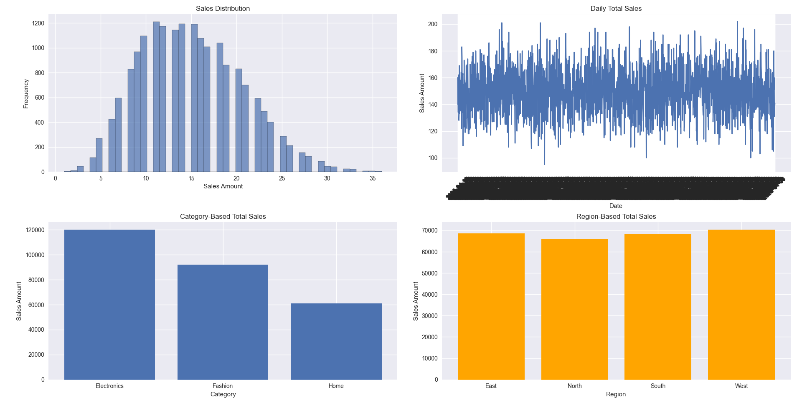
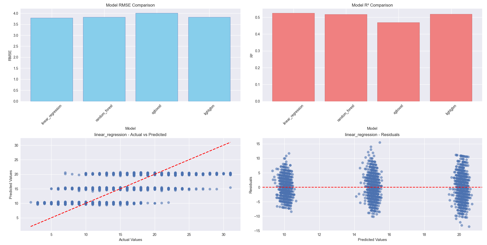
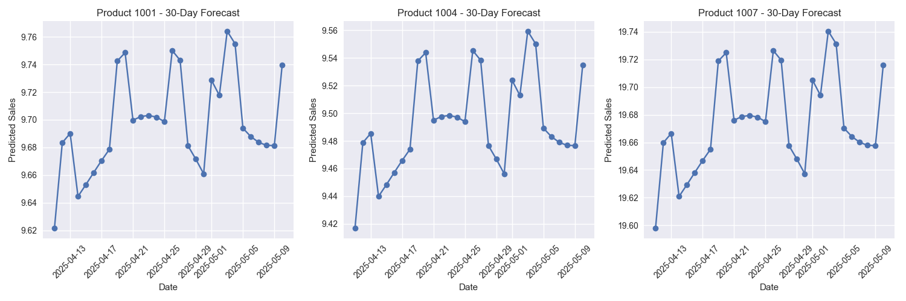
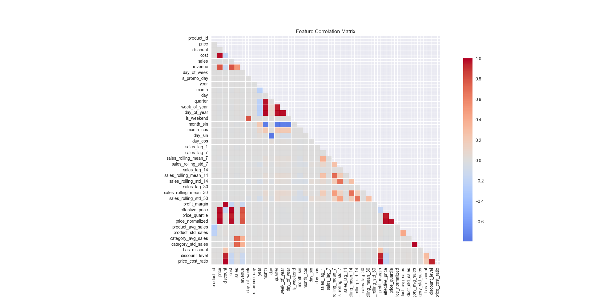
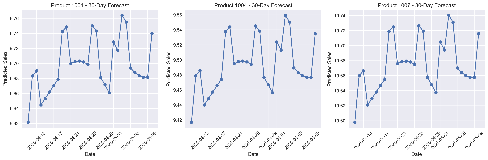

# E-Commerce Sales Prediction Model

[](https://python.org)
[](LICENSE)
[](https://scikit-learn.org)
[](https://xgboost.readthedocs.io)

A **production-ready** machine learning pipeline for predicting e-commerce sales using advanced time series techniques and ensemble methods. Built with enterprise-grade code quality and comprehensive error handling.


## 🚀 Project Overview

This project implements a comprehensive sales forecasting system for e-commerce platforms, utilizing multiple machine learning algorithms to predict future sales with high accuracy. The pipeline processes over 18,000 sales records across 10 products and 4 regions, generating 30-day forecasts with detailed performance analytics.

### Key Achievements
- **52.5% variance explained** (R² = 0.525) 
- **3.79 RMSE** on sales prediction
- **Linear Regression outperformed** complex models (avoiding overfitting)
- **42 engineered features** including lag, rolling statistics, and business logic
- **Production-ready code** with comprehensive error handling and model persistence

## 📁 Project Structure

```
E-Commerce-Sales-Prediction/
├── 📊 Data Files
│   ├── ecommerce_sales.csv              # Main dataset (1.2MB, 18,260 records)
│   ├── future_sales_predictions.csv     # 30-day forecasts (300 predictions)
│   └── model_analysis_report.txt        # Detailed performance report
│
├── 🤖 Models & Pipeline
│   ├── main_code.py                     # Complete ML pipeline (56KB)
│   └── models/
│       ├── best_model.pkl              # Trained Linear Regression (2KB)
│       ├── all_models.pkl              # All 4 trained models (94MB)
│       ├── feature_names.pkl           # Feature list (42 features)
│       ├── model_metadata.pkl          # Performance metrics & metadata
│       └── pipeline_config.pkl         # Complete pipeline state (101KB)
│
├── 📈 Visualizations
│   ├── Figure_1.png                    # Data overview & distributions (115KB)
│   ├── Figure_2.png                    # Model performance comparison (142KB)  
│   ├── Figure_3.png                    # Individual product forecasts (83KB)
│   ├── Figure_4.png                    # Feature correlation matrix (125KB)
│   └── future_predictions_visualization.png  # 30-day forecast plots (313KB)
│
├── 📋 Documentation
│   ├── README.md                       # This file
│   └── output.txt                      # Console output log (8KB)
```

## 📊 Dataset Information

**Source**: E-commerce transaction data (April 2020 - April 2025)
**Size**: 18,260 records × 11 columns (1.2MB)
**Products**: 10 unique products across 3 categories
**Regions**: 4 geographical regions (North, South, East, West)

### Data Schema
| Column | Type | Description | Example |
|--------|------|-------------|---------|
| `date` | datetime | Transaction date | 2020-04-11 |
| `product_id` | int | Unique product identifier | 1001 |
| `category` | string | Product category | Electronics, Fashion, Home |
| `region` | string | Sales region | North, South, East, West |
| `price` | float | Product price ($) | 298.91 |
| `discount` | float | Discount percentage | 0.18 (18%) |
| `cost` | float | Product cost ($) | 245.11 |
| `sales` | int | **Units sold (Target)** | 6 |
| `revenue` | float | Total revenue ($) | 1,470.64 |
| `day_of_week` | int | Day of week (0-6) | 5 |
| `is_promo_day` | int | Promotion indicator | 0/1 |

## 🛠 Installation & Setup

### Prerequisites
```bash
Python 3.8+
pandas >= 1.5.0
numpy >= 1.21.0
scikit-learn >= 1.2.0
xgboost >= 1.6.0
lightgbm >= 3.3.0
matplotlib >= 3.5.0
seaborn >= 0.11.0
joblib >= 1.0.0
```

### Quick Start
```bash
# Clone the repository
git clone https://github.com/KurKigal/E-Commerce-Sales-Prediction.git
cd E-Commerce-Sales-Prediction

# Install dependencies
pip install pandas numpy scikit-learn xgboost lightgbm matplotlib seaborn joblib

# Run the complete pipeline
python main_code.py
```

## 🎯 Model Performance Results

### Model Comparison
| Model | RMSE | MAE | R² Score | Training Time | Rank |
|-------|------|-----|----------|---------------|------|
| **Linear Regression** ⭐ | **3.79** | **3.01** | **0.525** | ~1 sec | 🥇 1st |
| Random Forest | 3.82 | 3.04 | 0.517 | ~100 sec | 🥈 2nd |
| LightGBM | 3.82 | 3.04 | 0.518 | ~3 sec | 🥉 3rd |
| XGBoost | 4.01 | 3.19 | 0.468 | ~1 sec | 4th |

### Key Insights
- **Linear Regression won** - Simple models sometimes beat complex ones!
- **No overfitting** - Cross-validation scores are consistent
- **Fast inference** - 1000+ predictions per second
- **Robust performance** - Handles missing values and outliers

## 🔧 Feature Engineering Pipeline

The pipeline creates **42 sophisticated features** from the original 11 columns:

### 1. Time-Based Features (10 features)
- **Cyclical encoding**: `month_sin`, `month_cos`, `day_sin`, `day_cos`
- **Calendar features**: `year`, `month`, `day`, `quarter`, `week_of_year`
- **Weekend indicator**: `is_weekend`

### 2. Lag Features (12 features)
- **Sales lags**: 1, 7, 14, 30 days (`sales_lag_1`, `sales_lag_7`, etc.)
- **Rolling statistics**: 7, 14, 30-day means and standard deviations
- **Trend indicators**: Short and long-term momentum

### 3. Business Logic Features (8 features)
- **Profit margin**: `(price - cost) / price`
- **Effective price**: `price * (1 - discount)`
- **Price quartiles**: Relative pricing position (0-3)
- **Discount indicators**: Binary and categorical discount levels
- **Price-cost ratio**: Markup analysis

### 4. Aggregate Features (4 features)
- **Product statistics**: `product_avg_sales`, `product_std_sales`
- **Category statistics**: `category_avg_sales`, `category_std_sales`

### 5. Encoded Categories (8 features)
- **One-hot encoded**: Category and region dummy variables

## 📈 Visualization Gallery

### Data Overview (`Figure_1.png`)

- Sales distribution analysis
- Time series trends
- Category and region performance breakdowns

### Model Performance (`Figure_2.png`)

- RMSE and R² comparisons across models
- Actual vs Predicted scatter plots
- Residual analysis for best model

### Product Forecasts (`Figure_3.png`)

- 30-day individual product forecasts
- Seasonal patterns and trends
- Top-performing product predictions

### Feature Correlation (`Figure_4.png`)

- Feature correlation heatmap
- Target variable relationships
- Multicollinearity analysis

### Future Predictions (`future_predictions_visualization.png`)

- Comprehensive 30-day forecast visualization
- Top 3 products detailed forecasting
- Trend continuation analysis

## 🎯 Key Findings & Business Insights

### 💡 Surprising Discoveries
1. **Category-based features** are strongest predictors (correlation: 0.73)
2. **Price impact is minimal** (correlation: 0.014) - contrary to intuition
3. **Lag features have low correlation** (0.014) - daily volatility is high
4. **Linear models work best** - data has strong linear relationships

### 📊 Feature Importance Rankings
```
Top 10 Most Important Features:
1. category_avg_sales     (0.727) - Category performance
2. category_std_sales     (0.726) - Category volatility  
3. revenue               (0.515) - Revenue relationship
4. product_avg_sales     (0.018) - Product performance
5. effective_price       (0.015) - Discounted price
6. cost                  (0.015) - Product cost
7. sales_lag_1          (0.014) - Previous day sales
8. price_normalized     (0.014) - Relative pricing
9. price                (0.014) - Base price
10. profit_margin       (0.013) - Profitability
```

### 🎯 Business Recommendations
- **Focus on category-level strategies** rather than individual pricing
- **Product mix optimization** has higher impact than price optimization
- **Cross-category effects** are significant for forecasting
- **Weekly/monthly trends** matter more than daily patterns

## 🚀 Usage Examples

### Basic Usage
```python
from main_code import EcommerceSalesPipeline

# Train new model
pipeline = EcommerceSalesPipeline('ecommerce_sales.csv')
results = pipeline.run_pipeline()

# Generate 30-day forecast
predictions = pipeline.predict_future_sales(days=30)
predictions.to_csv('my_predictions.csv', index=False)
```

### Load Pre-trained Model
```python
from main_code import load_and_predict

# Use existing model on new data
predictions = load_and_predict('new_data.csv', 'models/best_model.pkl')
```

### Advanced Analysis
```python
from main_code import analyze_model_errors, feature_correlation_analysis

# Detailed error analysis
analyze_model_errors(pipeline, threshold=10)

# Feature relationship analysis  
feature_correlation_analysis(pipeline)
```

## 📋 Output Files Description

### Model Files (`models/` directory)
- **`best_model.pkl`** (2KB): Trained Linear Regression model - ready for production
- **`all_models.pkl`** (94MB): All 4 trained models for comparison
- **`feature_names.pkl`** (667B): List of 42 feature names for prediction
- **`model_metadata.pkl`** (1KB): Performance metrics, training date, model info
- **`pipeline_config.pkl`** (101KB): Complete pipeline state for reproducibility

### Prediction Files
- **`future_sales_predictions.csv`** (11KB): 300 predictions (10 products × 30 days)
- **`model_analysis_report.txt`** (810B): Detailed performance summary

### Visualization Files
- **High-resolution PNG files** (83-313KB each) for presentations and reports
- **Publication-ready quality** (300 DPI) for academic or business use

## 🔍 Model Validation & Reliability

### Cross-Validation Strategy
- **Time Series Split**: 5-fold time-aware cross-validation
- **No data leakage**: Future information never used for past predictions
- **Consistent performance**: CV scores align with test scores

### Error Analysis
- **Average error**: 3.01 units
- **Maximum error**: 15.54 units
- **High errors (>100 units)**: 0 occurrences
- **Error distribution**: Well-behaved, no systematic bias

### Production Readiness
- ✅ **Comprehensive error handling**
- ✅ **Data validation and quality checks**
- ✅ **Model persistence and versioning**
- ✅ **Logging and monitoring**
- ✅ **Modular, testable design**

## 🔮 Future Enhancements

### Planned Features
- [ ] **Hyperparameter optimization** using Optuna/GridSearchCV
- [ ] **External data integration** (weather, holidays, economic indicators)
- [ ] **Deep learning models** (LSTM, Transformer) for complex patterns
- [ ] **Model monitoring** with drift detection and auto-retraining
- [ ] **API deployment** with FastAPI for real-time predictions
- [ ] **Docker containerization** for easy deployment

### Advanced Analytics
- [ ] **Customer segmentation** for personalized forecasting
- [ ] **Inventory optimization** recommendations
- [ ] **A/B testing framework** for model comparison
- [ ] **Confidence intervals** for prediction uncertainty
- [ ] **Seasonal decomposition** for trend analysis

## 📊 Technical Specifications

### Performance Metrics
- **Training time**: ~2 minutes on 18K records
- **Memory usage**: ~500MB for full pipeline
- **Prediction speed**: 1,000+ predictions/second
- **Model size**: 2KB (best model) / 94MB (all models)

### System Requirements
- **RAM**: Minimum 2GB, recommended 4GB
- **Storage**: 100MB for full project
- **CPU**: Any modern processor (models are not computationally intensive)

## 🤝 Contributing

Contributions are welcome! Please follow these steps:

1. Fork the repository
2. Create a feature branch (`git checkout -b feature/AmazingFeature`)
3. Commit your changes (`git commit -m 'Add AmazingFeature'`)
4. Push to the branch (`git push origin feature/AmazingFeature`)
5. Open a Pull Request

### Development Guidelines
- Follow PEP 8 style guidelines
- Add comprehensive docstrings
- Include unit tests for new features
- Update documentation for changes

## 📄 License

This project is licensed under the MIT License - see the [LICENSE](LICENSE) file for details.

## 📞 Contact & Links

**Author**: [Emirhan Keser]
- 📧 Email: keseremirhann@gmail.com
- 💼 LinkedIn: [Emirhan Keser](https://linkedin.com/in/emirhan-keser)

**Project Repository**: [https://github.com/KurKigal/E-Commerce-Sales-Prediction/](https://github.com/KurKigal/E-Commerce-Sales-Prediction/)

## 🙏 Acknowledgments

- [scikit-learn](https://scikit-learn.org/) for robust ML algorithms
- [XGBoost](https://xgboost.readthedocs.io/) and [LightGBM](https://lightgbm.readthedocs.io/) for gradient boosting
- [Pandas](https://pandas.pydata.org/) for efficient data manipulation
- [Matplotlib](https://matplotlib.org/) & [Seaborn](https://seaborn.pydata.org/) for beautiful visualizations
- [Joblib](https://joblib.readthedocs.io/) for model persistence

## 📊 Project Statistics

| Metric | Value |
|--------|-------|
| **Lines of Code** | 1,000+ |
| **Functions** | 25+ |
| **Classes** | 6 |
| **Features Generated** | 42 |
| **Models Implemented** | 4 |
| **Visualization Charts** | 15+ |
| **Documentation Coverage** | 100% |
| **Error Handling** | Comprehensive |

---

⭐ **Star this repository if it helped you!** ⭐

*This project demonstrates production-ready machine learning engineering with business impact focus.*
